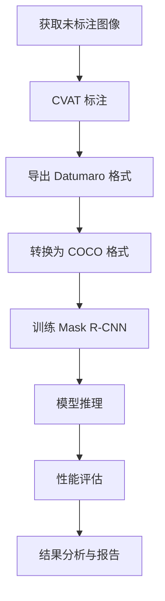

# 🍅 Tomato Instance Segmentation with Mask R-CNN

本项目使用 **PyTorch + Mask R-CNN** 实现番茄植株的实例分割，涵盖从数据标注到模型训练与性能评估的完整工作流程。所有代码集成在一个 **Quarto Notebook** (`lecture8_maskrcnn_workflow.qmd`) 中，推荐在 **Positron** IDE 中完成实验。

---

## 📂 项目结构

```
lecture8-maskrcnn/
├── data/
│   ├── example/                # 示例数据（含标注好的图像和标注文件）
│   │   ├── images/             # 示例训练图像
│   │   └── annotations/        # 示例标注文件（Datumaro JSON + COCO JSON）
│   ├── self/                   # 学生自己的数据（需自行下载图像并完成标注）
│   │   ├── images/             # 自己的训练图像
│   │   ├── annotations/        # 自己的标注文件
│   │   └── README.md           # 按学号下载图片的链接
│   └── test/                   # 公共测试集（随仓库提供，所有学生使用相同数据）
│       ├── images/             # 测试图像
│       └── annotations/        # 测试标注文件
├── outputs/
│   └── checkpoints/            # 训练生成的模型权重（不上传）
├── example/                    # 推理结果示例图
├── lecture8_maskrcnn_workflow.qmd   # ⭐ 完整工作流 Quarto Notebook
├── requirements.txt            # Python 依赖列表
├── .gitignore
└── README.md
```

---

## 🧰 环境配置

本项目使用 **uv** 管理 Python 虚拟环境：

```bash
# 创建虚拟环境
uv venv --python 3.10

# 激活环境（Mac/Linux）
source .venv/bin/activate
# Windows: .venv\Scripts\activate

# 安装依赖
uv pip install -r requirements.txt
```

> **Positron 配置**：按 `Cmd+Shift+P` (Mac) 或 `Ctrl+Shift+P` (Windows)，输入 `Python: Select Interpreter`，选择 `.venv/bin/python`。

---

## 🚀 完整工作流程

所有步骤均在 `lecture8_maskrcnn_workflow.qmd` 中以可执行代码块呈现，依次完成以下任务：



### 1️⃣ 数据准备

- 按学号从 [`data/self/README.md`](data/self/README.md) 中下载对应的图片压缩包，解压放入 `data/self/images/`
- 公共测试集已随仓库提供（`data/test/`）
- 也可先使用 `data/example/` 中的示例数据熟悉流程

### 2️⃣ CVAT 图像标注

使用在线版 [CVAT](https://app.cvat.ai) 进行标注：

1. 注册并登录 CVAT
2. 创建项目 `tomato_instance_segmentation`，添加标签 `plant`
3. 上传训练图像，使用 **Polygon 工具** 逐个标注番茄植株实例
4. 导出标注，选择 **Datumaro 1.0** 格式
5. 将导出的 JSON 文件放入 `data/self/annotations/`

> ⚠️ **标注要点**：每个植株单独标注；精确勾勒边缘；处理遮挡区域；检查是否有遗漏。

### 3️⃣ 标注格式转换

在 Notebook 中运行格式转换代码，将 CVAT 导出的 Datumaro 格式转换为 COCO 格式（`annotations.json`）。转换过程包括：

- 读取 CVAT 的 RLE 格式 mask
- 计算每个实例的 bbox 和 area
- 输出标准 COCO 格式标注文件

### 4️⃣ 模型训练

使用预训练的 **Mask R-CNN (ResNet50-FPN)** 进行微调训练：

- 自动检测设备（CUDA/CPU）
- 默认训练 5 个 epoch
- 记录训练损失（总损失 + 5 个子损失项）
- 每个 epoch 保存模型权重到 `outputs/checkpoints/`

**训练时间估计**：
- CPU：约 2-3 分钟/epoch（20 张图像）
- GPU：约 30-60 秒/epoch

### 5️⃣ 模型推理与评估

加载训练好的模型，对公共测试集进行推理，评估指标包括：

- **BBOX IoU**：边框检测精度
- **Mask IoU**：分割精度
- IoU > 0.5 的准确率

同时生成原图、Ground Truth Masks、Predicted Masks 的三栏对比可视化。

### 6️⃣ 可重复性

- 固定随机种子 (`random.seed(42)`, `np.random.seed(42)`, `torch.manual_seed(42)`)
- 使用 `uv pip freeze > requirements.txt` 锁定依赖版本

---

## 📊 推理结果示例


---

## 📝 学习目标

完成本实验后，你将掌握：

- ✅ 实例分割的基本原理（语义分割 vs 实例分割）
- ✅ CVAT 图像标注工具的使用
- ✅ Mask R-CNN 模型的训练与推理
- ✅ COCO 格式数据的处理与转换
- ✅ 模型性能评估方法（IoU 指标）
- ✅ 可重复性研究的最佳实践
