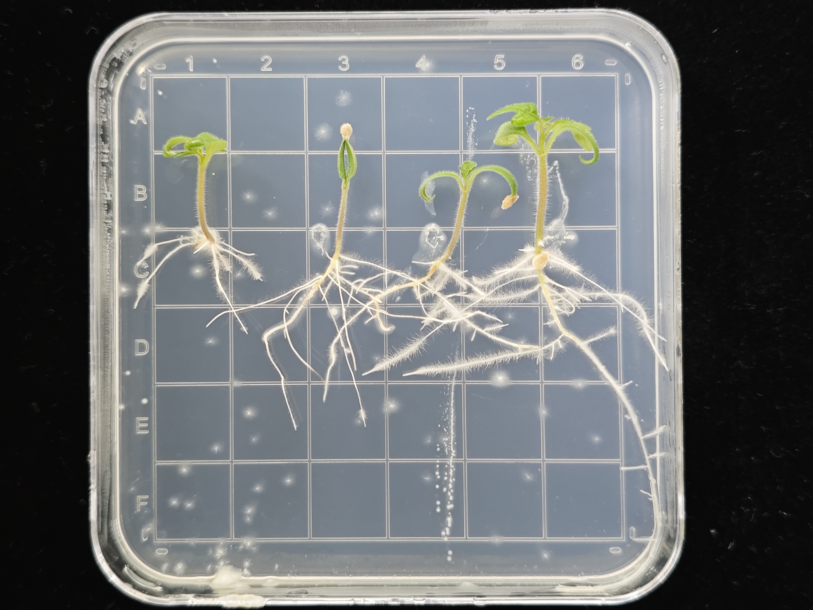
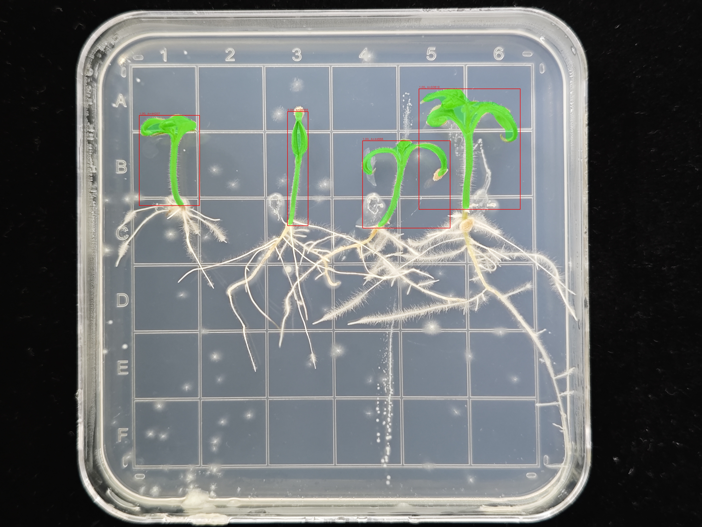

# 🍅 Tomato Instance Segmentation with Mask R-CNN (PyTorch)

本项目使用 **PyTorch + Mask R-CNN** 实现番茄植株的实例分割，支持 **CPU训练**，适合课程教学与小规模实验。  
数据采用 **COCO 格式（RLE segmentation）**，训练过程会自动生成损失曲线图。

---

## 📂 项目结构

```
maskrcnn/
│
├── lecture8_maskrcnn_workflow.qmd         # 数据整理与模型训练脚本（CPU）
│
├── data/
│   ├── images/              # 训练图片（不上传）
│   ├── annotations/         # 标注文件（不上传）
│   └── test/                # 测试与评估标准图片
│
├── outputs/
│   ├── checkpoints/         # 模型权重（不上传）
│   └── plots/               # 损失曲线（不上传）
│
├── requirements.txt         # 依赖列表
├── .gitignore               # 忽略数据与输出
└── README.md                # 项目说明
```

---


## 🧰 环境的创建与依赖安装

```bash
# 创建虚拟环境
uv venv --python 3.10

# 激活环境
source .venv/bin/activate   # Mac/Linux
# 或 .venv\Scripts\activate      # Windows

# 使用uv安装依赖
uv pip install -r requirements.txt
```

---

## 🧾 数据转换

把标注好的 **Train.json** 放入 data/annotations 下面；把训练集图片放入 data/images 下面。


### 运行结束后会生成训练所需json（annotations.json）：

```bash
data/annotations/
└── annotations.json   # 训练所需格式的json

```
## 🚀 训练模型（CPU）

### 训练结束后会生成训练结果：

```bash
outputs/
│
├── plots/
│   ├── loss_total_iter.png        # 总损失曲线
│   └── loss_components_iter.png   # 五个损失项曲线
│
└── checkpoints/
    └──  model_epoch_1-5.pth         # 模型权重
```


## 🔍 推理（Inference）


结果示例：




